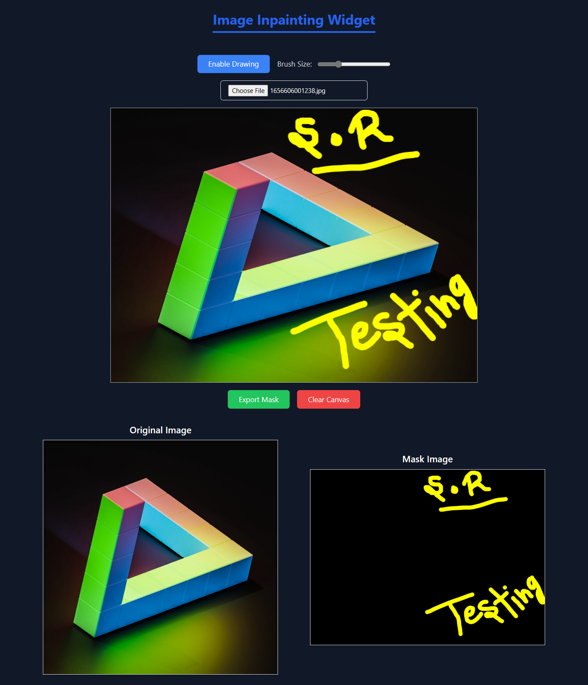

# Image Inpainting Widget

Image Inpainting Widget allows users to upload an image, draw a mask using a brush, and export the mask image for further use.  


---

## **Features**  
- Upload an image (JPEG/PNG).  
- Draw masks on the uploaded image using brush tools.  
- Adjust brush size dynamically.  
- Export the generated mask image as a separate file.  
- View the original image and the mask side by side.  

---

## **How to Run the Project Locally**  

### **Prerequisites**  
- Node.js (v16 or above) installed on your system.  
- Git installed.  

### **Steps to Run**  
1. Clone the repository:  
  ```
   git clone <paste repository-url>
   cd <repository-folder>
  ```

2. Install fabricjs-react Dependencies: 
  ```
   npm install fabricjs-react
  ```
3. Start the development server:
  ```
    npm start
  ```

## **Libraries Used**
- **React:** For building the application.
- **Fabric.js:** For canvas drawing functionality.
- **TailwindCSS:** For responsive and modern styling.

## **Challenges Faced**  

### **Canvas Mask Rendering**  
- **Challenge**: Ensuring paths drawn on the canvas were correctly exported as a mask image.  
- **Solution**: Created a temporary canvas to handle black-and-white rendering for the mask.  

### **Image Scaling**  
- **Challenge**: Scaling the uploaded image to fit within the canvas dimensions.  
- **Solution**: Utilized Fabric.js's `setBackgroundImage` with scaling options.  

### **Dynamic Brush Controls**  
- **Challenge**: Synchronizing brush size changes dynamically.  
- **Solution**: Updated the `freeDrawingBrush` properties on `Fabric.js` when brush size was adjusted.  

